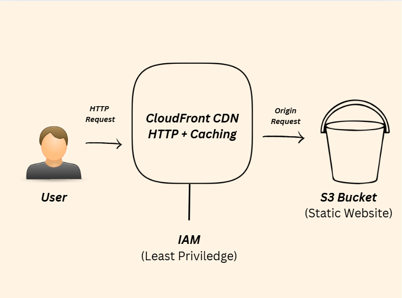

# AWS Static Website Hosting Project

In this project, a static website was deployed to AWS using multiple core services:

- **Amazon S3** → for static website hosting 

https://my-mini-project-site.s3.us-east-1.amazonaws.com/index.html

- **IAM** → Applying least priviledge.

    - `s3:GetObject`, `s3:PutObject` on `my-bucket` (read/write permissions)
    - Attached policy file: `Admin-policy.json` contains the full policy with the above permissions

- **CloudFront** → for global content delivery  
    - *Enabled Caching* to improved performance (using AWS recommended settings)
    - Configured *custom error pages*:
        - Added `404.html` (stored in the `/src` folder) as the error response for missing pages.

## Documentation folder 

- Contains extra screenshots